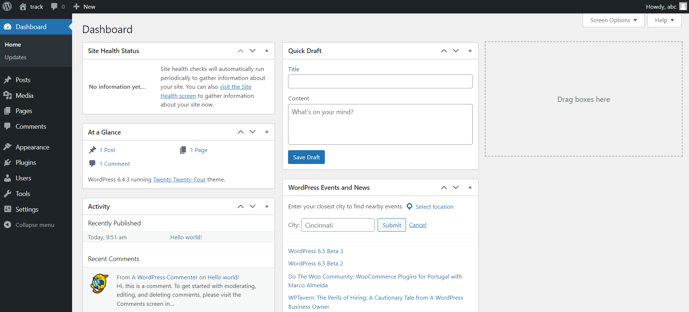

# A basic WordPress website.

---

As you see, this is what the WordPress dashboard looks like :

You won't be using many things from this Dashboard in the first moment.

Pay attention to the sections :

- Media
- Pages
- Appearence > Themes
- Plugins
- Users > Profile
- Settings > Reading

And later, when we will install the `ACF plugin`, you'll have a tab "ACF".

With ACF, you will also have the possibility to create "Custom Posts Types" (which we will see later) that will appear as tabs with the name you'll give them.

For now, it's where you will navigate.

---

Let's begin by erasing all default `pages`, `posts` and `comments` we have. Let's start clean !

You also can disable and delete all pre-installed `plugins`. (With Local you won't have any.)

---

If you go to Appearence > Themes, you'll se there a few themes available and one will be activated.

**What is a theme?**

A theme is a website by itself.

Honestly, there is no need to have many themes. Your WordPress will be powering ONE website, so we will be erasing all these themes and start one from scratch. (we will erase them simply by deleting it in the installation folder very soon).

For now, you can go visit the website that exists. You can do this either by clicking in the little home button at the top left, or changing the URL (get rid of /wp-admin)

You see now the website ?

It's a regular website with some texts, images, links, etc.

Our goal will be to create a website (as you would do with pure HTML, CSS, JavaScript) and then "connect" all the dynamic content we want to texts, images, links, etc. to it so we can edit them within the dashboard and not directly in the code.

For this, we will be creating pages and custom fields (fields where we will be able to enter the text we want to be linked to the PHP file).

For now, you can activate another theme and check the websites.
