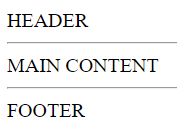

# Header and Footer

---

These two files, `header.php` and `footer.php` are reserved names that you can call from your pages to include the header and the footer respectively.

This is done through `native functions` of WordPress.

### Header

Basically, in your `header.php` you can start the HTML boilerplate :

```php
<!DOCTYPE html>
<html <?php language_attributes() ?>>
<head>
    <meta <?php bloginfo("charset") ?>>
    <meta http-equiv="X-UA-Compatible" content="IE=edge">
    <meta name="viewport" content="width=device-width, initial-scale=1.0">
    <title><?php bloginfo("name") ?></title>
    <?php wp_head() ?>
</head>
<body <?php body_class(); ?>>
```

As you can see there are dynamic content inserted in this HTML head boilerplate. Let's analyze them and understand how WordPress interferes dynamically with the HTML content.

---

Usually, in the `<html>` tag you would define a language attribute (`lang="en"` for example).

By calling this WordPress function (`bloginfo("charset")`) you are "echoing" to the markup the language of your WordPress admin. Which means that, if you have a multi-language website, the HTML will automatically be set related to the actual language. No hard coding.

---

The goal here is to have the minimum of hard coded content possible. If you link all these info to the admin, you will be able to change them on the fly on the user-friendly admin dashboard instead of having to come back to your code.

---

Same thing for the function `<?php bloginfo("name") ?>`. This function echoes the title of your website. If it changes later, it will be automatically updated in the page the server responds with.

---

**The wp_head() function**

This functions must be included in every `<head>` tag you have on your site.

What does it do ?

Basically, it injects in the `<head>` tag many lines of code that are essential for the WordPress operation.

For example, we will see later that we can assign CSS files to the pages via the `functions.php` file. The `wp_head()` function will make sure to echo the link to this css file.

Many plugins for WordPress need to include lines of code in the `<head>` tag as well. That's how we allow this to happen.

---

### FOOTER

We follow here the same logic. We close the `<body>` tag and before it we call the function `wp_foot()`

```php
<?php wp_footer() ?>
</body>

</html>
```

Again... `wp_foot()` inserts automatically all the scripts that are necessary to WordPress as well as any script you decided to insert via the `functions.php`

---

Now, with the little knowledge you acquired from the last chapters, go ahead and build a veeeery simple page structure that contains a `header` with a title, a `body` with some text (hard coded) and a `footer`. From this we will get a little further in the next chapters.

- Try to have something like this, each part coming from its respective file :



---

At the end of this chapter, some things to be mastered :

- The logic behind the `wp_head` and `wp_footer`
- The goal of turn any information **dynamic**. No hard-coded text !
