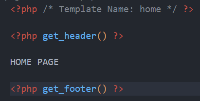
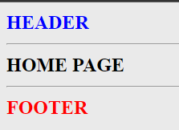
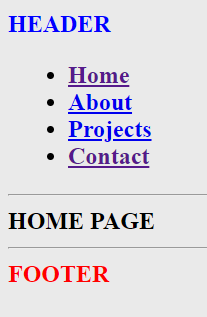

# Multi-pages

---

Let's incorporate a menu to our website so we can navigate programatically to other pages!

The `menu` of the website can be handled on the `appearence>menu` tab in the dashboard. If you go there now, you'll see there is no such a tab. That's because we didn't tell WordPress that our theme would have a menu. We need to "register" the menu in the `functions.php` file.

---

Let's get back to the ongoing project we have.

- In your `home` page, delete every content we developed untill now and just put an `h1` with `HOME PAGE`

- Create three other templates `about`, `projects` and `contact` in the same way you created `home`.
- In each one of these, include the header and the footer then put an `h1` with the name of the page ("ABOUT PAGE", "PROJECTS PAGE", etc.)
- In your dashboard, create these same pages and link them to their respective templates.
- You should now be able to change the url `/about`, etc and see the different pages.
- (Get rid of the alert in your JS so it doesn't disturb you all the time)

Your pages should look like this :

Etc.

What is missing now ? A menu !!!

We must be able to navigate to the other pages from the header. And remember : no hard coding is allowed in our theme !!!!!

- Go find out how to `register` a menu in the `functions.php` file.
- In the dashboard, in the `appearence>menus` tab (that now is displayed after registering), create a new menu and assign the multiple pages we have to it.
- Then, call it in the `header.php` file.

Some considerations...

- Try to really understand the difference between the slug of the menu and its value in the associative array of the `register_nav_menus`. (we call it in the code by its slug, the value is what will be displayed in the dashboard)
- Understand that we can have as many menus we want in your website and it's up to you to determine which menu will be showned where in your code.
- Notice that you can assign an item of your menu to a WordPress page, or any other link. Including an id in the page.
- Check in the inspector the markup structure WordPress created for the menu. There is a more complex way to customize it [see here](https://savvy.co.il/en/blog/wordpress-development/create-menu-clean-markup-wordpress-templates/#) but if you don't want to, adapt your css so it fits what you want.
-

Your page should look like this now :

Each link leading you to the correct page. :)

You have now a multipage website with a dynamic menu that you will handle via the dashboard !

Great job !!!
