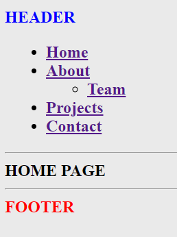

# Menu depth

---

Of course you've already noticed some website that have sub-menus inside its menu. Like a dropdown or something.

We can easily do this with WordPress as well.

- Create another page template called `team`
- Associate it to a new page in the dashboard, etc. blablabla
- Add it to the menu, but this time, as a sub-item of `About`.

Your menu should look like this now :

Pay attention to the markdown : We have a `ul` for the menu with some `li` and another `ul` inside a `li`. This is good practice to program a menu with many levels.
