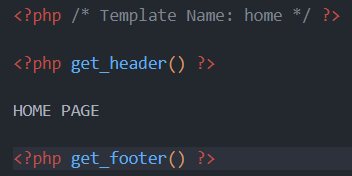

# The Loop

---

Often, when we start learning WordPress we begin with `The Loop`, a basic strategy to display all the blog posts we have in our website. The reason we didn't do it here is because I prefered to show how to create a **showcase website** before. Not a problem ! Let's see how we can incorporate a list of our posts in our main page and then be able to click on them to go to their specific page.

---

But first... Let's see some native WordPress functions that are used very often to retrieve a post information.

`the_title`, `the_content`, `the_date`, `the_permalink`, etc.

These functions echo the title of the post, its content, the date of publication, the link to the page, etc.

Let's try to understando some concepts...

Remember I told you everything in WordPress is considered as a post ? Even a page is treated as post. So, these functions are gonna echo the title of the "post" (even if it's a page), the date the "post" was published, the permalink (the link/url of the page/post basically), etc.

Try for yourself!

In `home.php` (the page you created at the begin), you should have something like this :



- Now, erase the hard coded `HOME PAGE` and, in php, call `the_title()`

- Now, insert this :

  ```php
  <p> Date of publication :
  <?php
    $date = get_the_date();
    echo $date;
  ?>
  </p>
  ```

See ? You have the date of `publication` of the page. (When you created it)
