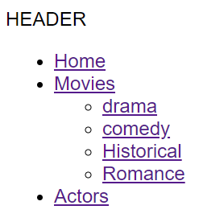

# Taxonomy

---

In WordPress, a taxonomy is a system for classifying and organizing your content. It's like a filing cabinet for your website, but instead of folders, you use categories and tags (or even custom groupings) to arrange your posts. Think of them as **categories** of post.

For a matter o fact, the default taxonomy that already exists in a WordPress website is called `category`. (Like the post-type `post` is the dafault one as well.) But you can create as many you want with the name you want.

In our simple movie project, we could for example create a custom taxonomy "genres" so we can classify the movies we have.

---

Some characteristics :

**Grouping similar things**: Taxonomies allow you to group posts that share a characteristic. For instance, on a sports website, you could have a category for each sport (football, basketball, etc.) and assign relevant articles to each category.

**Improved navigation**: By grouping related content, taxonomies make it easier for users to find what they're looking for on your website. Imagine searching for "basketball news" - a category for basketball articles would lead users right there.

**Improved navigation**: By grouping related content, taxonomies make it easier for users to find what they're looking for on your website. Imagine searching for "basketball news" - a category for basketball articles would lead users right there.

**Custom taxonomies**: You can also create custom taxonomies to fit your specific needs. For example, a recipe website might benefit from a "cook time" taxonomy to categorize recipes by their preparation time.

Overall, taxonomies are a powerful tool for keeping your WordPress content organized and user-friendly.

---

Try for yourself :

- First, get to know the difference between hierarchical and non-hierarchical taxonomy. (As a hint : think of the difference between a `tag` and a `category`)
- After you got the difference, create a custom taxonomy `genres` so we can classify our movies.
- For each movie, assign them to a specific genre. (can you assign them to multiple genres ?)
- Insert the genres you created as a sub-menu of movies in the header.
  (something like this : )

- Make that when you click on a genre, you go directly to a page with all the movies from this genre. (look for the specific page you need to create in order to do that as well as how you can query the movies with the specifc chosen genre)
- Create pagination inside these pages as well.
- Now, create a new taxonomy `actor` and link the actors that belong to the movies.
- In the movie single-page, make sure to display the actors that belong to the movie.
- Make these actor tags clickable so you are redirected to the specifc actor's page you clicked on.

Ouff... Nice job!!!!
We're getting close to a very nice little movies/actors platform. :)
