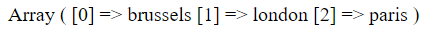
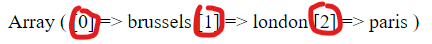
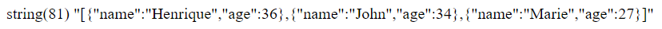

# Arrays

---

We can define an array in two ways :

```php
$my_array = [1, 4, true, "Hello"];

$my_other_array = array("brussels", "london", "paris");
```

If you do a `print_r($my_other_array);` you'll see the formatted array in your browser :



See in red the "index" of each element of the array.



You can access an element of the array as such :

```php
$my_other_array[1] // "london"
```

These indexes start from 0.

However, there is such a thing called `associative arrays` where you will establish the "name" of an index.

It presents itself as such :

```php
$my_assoc_array = ["first_name" => "Henrique", "last_name" => "Vieira", "age" => 36];
```

And you can then access the elements like this :

```php
$my_assoc_array["first_name"]; // "Henrique"
```

Sounds familiar ? It's kind of an `object` in JavaScript.However we also have objects in PHP. So what's the difference ? Go find out !

---

Remember, an element of an array can be an array itself. We can then have an array of associative arrays. (much like an array of objects in JavaScript)

```php
$persons = [
    [
        "name" => "Henrique",
        "age" => 36
    ],
    [
        "name" => "John",
        "age" => 34
    ],
    [
        "name" => "Marie",
        "age" => 27
    ]
]
```

And you can access any of them like this :

```php
echo $person[1]["age"] // Prints 34
```

Because it's associative arrays are not exactly JavaScript objects, this is not compatible with the JSON format.

We can use one of the many, many, many native functions of PHP to transform it :

```php
var_dump(json_encode($persons));
```

The result will be a huge string formatted as JSON :



(See ? This is a JSON string)
