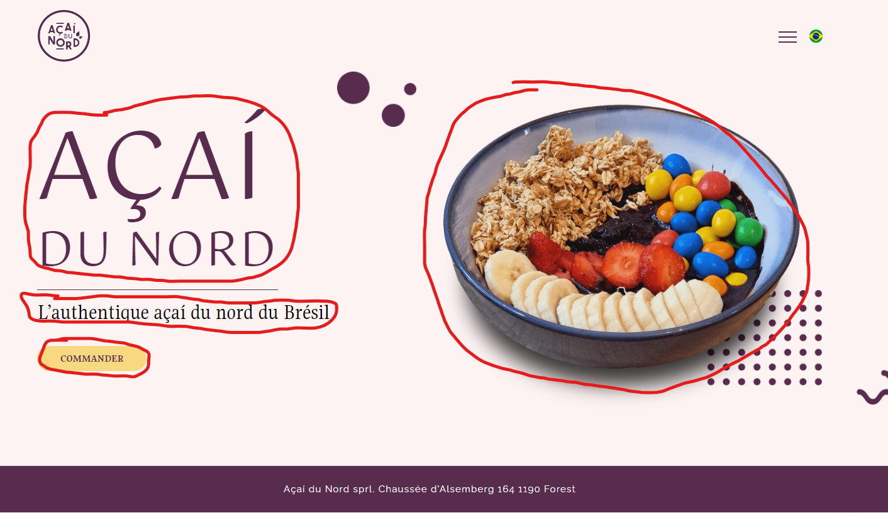

# ACF

---

_Advanced Custom Fields_ is a very powerful plugin that offers a complete solution to easy create custom fields for your pages and posts.

What are custom fields ?

If you go to a page in the dashboard, you'll see that the only place you can enter content (text, images, etc.) is in a WYSIWYG text area. (or... if in some chapters ago you removed it from inside `function.php` you just won't have anything).

The goal here is to have as many inputs (fields) that the user can fill with text, or upload an image, set a link, etc. as we need for our project.

---

Think of this hero section of a landing page :

There is a title `Açaí du Nord` that I must echo in a specific part of my code (in this case, my `h1`)

There is a subtitle `L'authentique açaí du nord du Brésil` that I must echo in whatever tag I used fot the subtitle.

There is a button `Commander` that I must be able to set with this text, and associate it to a link text.

There is the hero image that I must be able to upload in order to echo its link text in my `img` tag. ...

Wouldn't it be nice to have separate fields where I can fill up individually all these information ?

Well... ACF allows you to do this in a very easy way!

---

**ASSIGNMENT**

- Go ahead and install the free version of the ACF plugin.

- Then, find a way to create exactly these fields I mentioned (title, subtitle, button with a link to somewhere and an image)
- After you did it, fill the fields and echo them to your page. (You will have to get along with the functions provided by ACF : `the_field()`, `get_field()`, etc. )

Good luck !

---

[Here](https://youtube.com/playlist?list=PLgFB6lmeXFOoyP8YUj7TmDnzFrrPcjCf3&si=y-CNqEoTgPAs71fq) is an excellent YouTube playlist about the use of ACF.

Note : the newest version of ACF is even better than the one used in this tutorial, allowing you to create Custom Post Types as well. We'll get there... ;)
